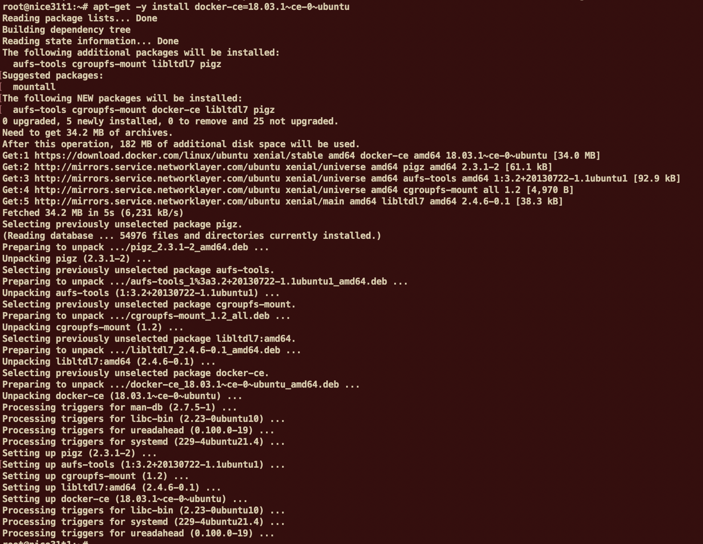
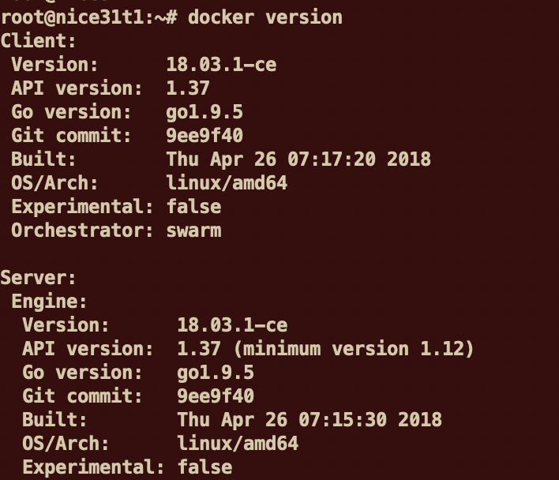
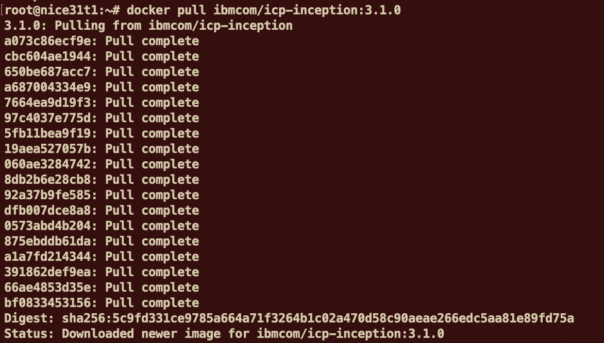
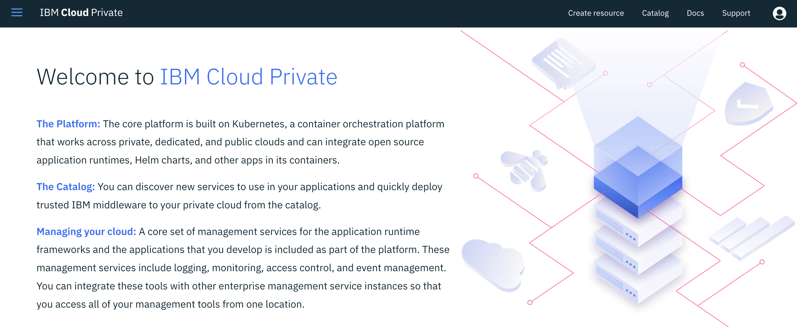
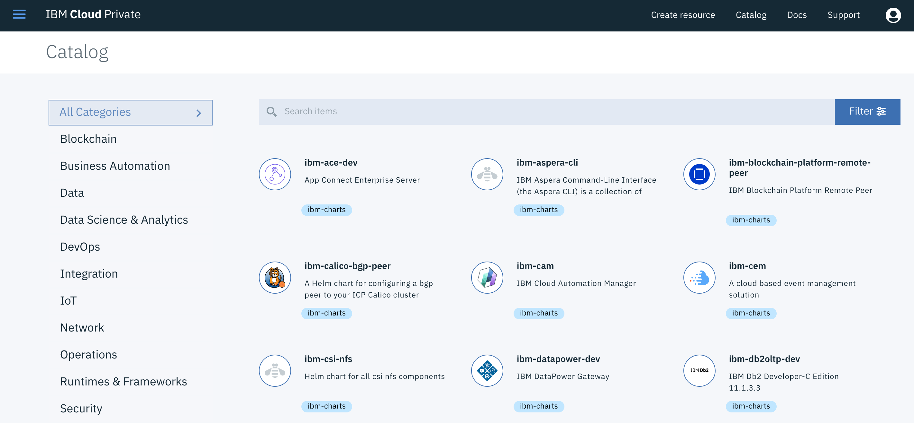

---
# Single Node Installation - IBM Cloud Private
---

This Lab is compatible with ICP version 3.1.0


# Table of Content

- [1. IBM Cloud Private Overview](#1-ibm-cloud-private-overview)
    + [What is a private Cloud ?](#what-is-a-private-cloud--)
    + [Terminology](#terminology)
    + [Architecture](#architecture)
- [2. Objectives](#2-objectives)
- [3. Prerequisites](#3-prerequisites)
- [4. Install ICP on a Ubuntu VM](#4-install-icp-on-a-ubuntu-vm)
    + [Task 1 : Configuring the system](#task-1---configuring-the-system)
    + [Task 2 : Add Docker’s official GPG key](#task-2---add-docker-s-official-gpg-key)
    + [Task 3: Add a repo to get the Docker](#task-3--add-a-repo-to-get-the-docker)
    + [Task 4: Get Docker](#task-4--get-docker)
    + [Task 5: Download IBM Cloud Private](#task-5--download-ibm-cloud-private)
    + [Task 6: SSH Keys setup](#task-6--ssh-keys-setup)
    + [Task 7: Customize ICP](#task-7--customize-icp)
    + [Task 7: Install ICP](#task-7--install-icp)
    + [Task 8: Install and configure CLIs](#task-8--install-and-configure-clis)
    + [Task 9: Adding persistent storage to Kubernetes](#task-9--adding-persistent-storage-to-kubernetes)
    + [Task 10. Installing helm](#task-10-installing-helm)
    + [Task 11. Last important step before starting the labs](#task-11-last-important-step-before-starting-the-labs)
- [5. Conclusion](#5-conclusion)
    + [Results](#results)
- [End of Lab](#end-of-lab)
- [appendix A : How to connect to a cluster](#appendix-a---how-to-connect-to-a-cluster)
- [appendix B : Changing ICP admin password](#appendix-b---changing-icp-admin-password)
    + [1. Login to your ICP cluster using ssh](#1-login-to-your-icp-cluster-using-ssh)
    + [2. Generate your new ICP password in base64](#2-generate-your-new-icp-password-in-base64)
    + [3. Edit ICP secrets](#3-edit-icp-secrets)
- [End of Appendix](#end-of-appendix)

---


# 1. IBM Cloud Private Overview

**IBM Cloud Private** is a private cloud platform for developing and running workloads locally. It is an integrated environment that enables you to design, develop, deploy and manage on-premises, containerized cloud applications behind your firewall. It includes the container orchestrator Kubernetes, a private image repository, a management console and monitoring frameworks.

### What is a private Cloud ?

 Private cloud is a cloud-computing model run solely for one organization. It can be managed internally or by third party, and can be hosted behind the company firewall or externally. Private cloud offers the benefits of a public cloud, including rapid deployment and scalability plus ease of use and elasticity, but also provides greater control, increased performance, predictable costs, tighter security and flexible management options. Customize it to your unique needs and security requirements.

### Terminology

- **master node** :  
    - controls and manages the cluster
    - **Kubectl**:  command line client
    - REST API:  used for communicating with the workers
    - Scheduling and replication logic
    - Generally 3 or more master nodes for resiliency
- **worker node**
    - is a worker machine in Kubernetes, previously known as a minion. A node may be a **VM** or **physical machine**, depending on the cluster. Each node has the services necessary to run pods and is managed by the master components.
    - **Kubelet**  agent that accepts commands from the master
    - **Kubeproxy**: network proxy service on a node level, responsible for routing activities for inbound or ingress traffic
    - Docker host
- **Containers**: Units of packaging
- **Pods**:
    - A collection of containers that run on a worker node
    - A pod can contain more than one service
    - Each pod has it’s own IP
    - A pod shares a PID namespace, network, and hostname
- **Replication Controller**
:
    - Ensures availability and scalability
    - Responsible for maintaining as many pods as requested by the user
    - Uses a template that describes specifically what each pod should contain
- **Labels**:

    - Metadata assigned to K8 resources – such as pods, services
    - Key-Value pairs for identification
    - Critical to K8s as it relies on querying the cluster for resources that have certain labels
- **Services:**
    - Collection of pods exposed as an endpoint
    - Information stored in the K8 cluster state and networking info propagated to all worker nodes
- **Secrets**:
    - Sensitive information that containers need to read or consume
    - Are special volumes mounted automatically so that the containers can read its contents
    - Each entry has it’s own path


### Architecture

See below a global picture showing ICP architecture and most common components.


This lab is going to focus on the couple "Docker & Kubernetes" which is the main foundation of IBM Cloud Private. In this lab, all nodes will be part of a single VM.

# 2. Objectives


In this first lab, you will prepare and install IBM Cloud Private (ICP) on a **single node** (host) running on a VM (this is a virtual Server in IBM Cloud).

You will learn how to:

- prepare your platform to support a single node ICP (i.e all nodes - master, worker, proxy, boot nodes will be concentrated in one node)
- configure the installation setup for ICP
- check and validate all the prerequisites
- install Docker and Hyperkube
- check all the components
- install different CLIs and other modifications to the cluster


# 3. Prerequisites

This lab needs some hardware and software prerequisites.

At least (minimal):
- [ ] one host (physical or virtual)
- [ ] CPU = 8 cores (or virtual cores)
- [ ] RAM = 32 GB
- [ ] Storage = 300 GB (depending on the other solutions that you install on top of ICP)
- [ ] Linux OS like Ubuntu 16.04 LTS 

If you need some more help, see the official documentation: [here](https://www.ibm.com/support/knowledgecenter/en/SSBS6K_3.1.0/kc_welcome_containers.html)

or

https://www.ibm.com/support/knowledgecenter/en/SSBS6K_3.1.0/kc_welcome_containers.html

# 4. Install ICP on a Ubuntu VM

Be sure that you have already prepared a VMware VM or a virtual server containing an **Ubuntu** system up and running. Login to the Ubuntu system as **root** or sudo -i once connected.

> **ipaddress** is the ip address of the VM and subsequently the ip address of the different nodes in this lab.
>
> Use **putty** or **ssh** to get connected to the ubuntu VM.

Here are the steps:

### Task 1 : Configuring the system

Before updating the operating system, check the **/etc/hosts** file in Linux.

`ssh root@ipaddress`


Once connected, update your system with:

`apt-get -q update`

Check your (public) ip address by typing the command:

`curl ifconfig.co`

Results:
```console
# curl ifconfig.co
158.175.102.12
```

> This address should be same as the one used to ssh your VM.
> Take a note of this ip address. This will be referred as **ipaddress** in the labs. 

Then, edit the hosts file with this command:

`nano /etc/hosts`

You should have the following lines already in the file:
```console
127.0.0.1	localhost
127.0.1.1	myhostname.workshop	myhostname
...
```

> Note : you can see some IP v6 definitions - **don't touch them**

> **Don't touch the hostnames**


**Very important : Don't touch or change the hostnames at this step or later on.**


Change the line containing **127.0.1.1** with your **ipaddress**. So it look like:

**123.456.789.123**   myhostname.workshop	    myhostname     

Your /etc/hosts file should look like that after the change (please don't touch the hostnames):

```console
# more /etc/hosts
127.0.0.1	        localhost
123.456.789.123 	niceicp15.sl.workshop	niceicp15
...
```

Save the file (ctrl O, enter, ctrl X )

Use the following 2 commands to **update** the system with some complementary packages:

```console
apt update
apt-get install apt-transport-https ca-certificates curl software-properties-common python-minimal jq
```

Check carefully the output to see if you have errors and especially if you cannot connect.


Increase your virtual memory maximum by typing the command:

`sysctl -w vm.max_map_count=262144`

K8s won't run with swap enabled. swapoff -a is the Ubuntu command for disabling it.

`swapoff -a`


> IMPORTANT. The 2 previous commands only work when the system is online. If it is rebooted then these settings are lost and have to be re-run before k8s will start. 

These commands can be turned on permanently by typing:

```
sed -i '/ swap / s/^/#/' /etc/fstab
echo "vm.max_map_count=262144" >> /etc/sysctl.conf
```


### Task 2 : Add Docker’s official GPG key

Use the following command:

```console
curl -fsSL https://download.docker.com/linux/ubuntu/gpg | apt-key add -
```

### Task 3: Add a repo to get the Docker

Use the following 2 commands:

```console
add-apt-repository "deb [arch=amd64] https://download.docker.com/linux/ubuntu $(lsb_release -cs) stable"
```

`apt-get update`

### Task 4: Get Docker

You can list all versions available in the added repo:

`apt-cache madison docker-ce`

Use the following command to get Docker installed (Docker version 18.03.1 is the maximum version supported by IBM Cloud Private 3.1.0):

`apt-get -y install docker-ce=18.03.1~ce-0~ubuntu`



Check that Docker is running (client and server):

`docker version`



> Docker client is mainly the CLI. The server is composed of different programs and among then, there is the **containerd**, the engine managing the isolation/running of containers.

You can look around at the docker CLI (and go thru some of  the sub-commands) by just typing:

`docker`

`docker ps`

`docker images`

Another lab will go in detail to explain how Docker is managing the images and running them.


### Task 5: Download IBM Cloud Private

We are going to use Docker to download the ICP-ce (community edition) package from the **dockerHub** web site:

`docker pull ibmcom/icp-inception:3.1.0`

IBM has packaged all the main components necessary for the installation in one package (note that you can change the version to a more recent one if needed). The pull sub-command is going to download the image on the local file system (the image will be run to install ICP).



Create a directory and move to that directory:

`mkdir /opt/icp`

`cd /opt/icp`  

Copy the ICP package into that directory:

```console
docker run -e LICENSE=accept -v "$(pwd)":/data ibmcom/icp-inception:3.1.0 cp -r cluster /data
```

> Note:  this docker command is executing the linux copy (cp) command from the volume (-v parameter). This will create a cluster directory in /opt/icp with all necessary files.


### Task 6: SSH Keys setup

We are going to generate new ssh keys in the /opt/icp/cluster directory:

`ssh-keygen -b 4096 -f ~/.ssh/id_rsa -N "" `

`cat ~/.ssh/id_rsa.pub | sudo tee -a ~/.ssh/authorized_keys `

`systemctl restart sshd `

`cp ~/.ssh/id_rsa ./cluster/ssh_key  `

> Finally a new key should now exist in the /opt/icp/cluster:

`ls /opt/icp/cluster`

Results:

```bash
# ls /opt/icp/cluster
cfc-certs  cfc-components  cfc-keys  config.yaml  hosts  logs  misc  ssh_key
```


### Task 7: Customize ICP

Add the IP address of each node in the cluster to the **/opt/icp/cluster/hosts file** (in our case, we use the same ip address for each component).

> Use the unique **ipaddress** that you have already used.

`nano /opt/icp/cluster/hosts`

Results:

```bash
[master]
169.51.44.149

[worker]
169.51.44.149

[proxy]
169.51.44.149

[management]
169.51.44.149

#[va]
#5.5.5.5
```


The last 2 lines (concerning va - vulnerability advisor) will stay commented.

Save the file (ctrl O, enter, ctrl X ).

To understand the installation setup, you can look at the **/opt/icp/cluster/config.yaml** where you will find all the parameters before the start of the installation.

`nano /opt/icp/cluster/config.yaml`

We are going to change the "config.yaml" file (**be carefull** this is a YAML file and you are not allowed to use TAB or any cyrillic characters) :

Find the line with :

`istio: disabled`

Change that line with the following:

`istio: enabled`

You can have a look into that file (there is a lot of features that you can implement like GlusterFS or VMware network SDN).

If you want to also **change the admin password**, find it in the config.yaml file:

`default_admin_password: admin`

Change it to something else but take a note of the new password.

Save the file (Ctrl+o, Enter, Ctrl+x)

> *hosts* and *config.yaml* are the 2 most important files to parameter during the ICP installation. In a "standard configuration" with multiple worker nodes, you should specify a list of IP addresses under the worker section in the *hosts* file. At the time of this version, only ip addresses are supported in the *hosts* file.

**You are now ready to install IBM Cloud Private**.


### Task 7: Install ICP

Finally install ICP by using those commands:

`cd /opt/icp/cluster`

```console
docker run -e LICENSE=accept --net=host -t -v "$(pwd)":/installer/cluster ibmcom/icp-inception:3.1.0 install
```

Installation should last around 20 minutes. Check messages.
In case of error (red messages), make the appropriate change in the configuration files. Sometimes the installation can slowdown a little bit with **Retrying** messages  (during IAM startup for instance).

The end of the installation should look like this :


> Note that during a simple installation, there are **no failures and no errors**. If some errors occur and the install exits then first retry the install command and follow the instructions. If it doesn't work then "uninstall" ICP, correct the issue and restart the install process.

**<u>In case of Uninstall</u>**

```console
docker run -e LICENSE=accept --net=host -t -v "$(pwd)":/installer/cluster ibmcom/icp-inception:3.1.0 uninstall
```

**BEFORE GOING TO THE NEXT STEP, WAIT a few MINUTES** so that everything can start gracefully.


Use the green link at the end of the installation script to get access to the console (admin/admin) in a browser:

`https://ipaddress:8443`  


You should receive the **Welcome Page**:



Click on the **Catalog** menu (top right) to look at the list of applications already installed:



The **Catalog** shows Charts that you can visit (it could take au few seconds to refresh the first time)

You can look at the (helm) catalog and visit some entries (but don't create any application at the moment).

### Task 8: Install and configure CLIs

At this point, you will need to install the **Kubernetes CLI** (command kubectl).  
For that purpose, open a ssh terminal with the Ubuntu VM in root mode.

Use the following command to download **kubectl**:

```console
docker run -e LICENSE=accept --net=host -v /usr/local/bin:/data ibmcom/icp-inception:3.1.0 cp /usr/local/bin/kubectl /data
```

This docker command will copy the kubectl program to the /usr/local/bin.

We now need to configure kubectl to get access to the cluster. An alternative method can be used (see Appendix A : How to get connected to the cluster) if you are interested.

We are going to create a **script** to help us to connect to our cluster.
Type the following commands :

`cd`

`nano connect2icp.sh`

Copy the following code :

```console
CLUSTERNAME=mycluster
ACCESS_IP=`curl ifconfig.co`
USERNAME=admin
PASSWD=admin

token=$(curl -s -k -H "Content-Type: application/x-www-form-urlencoded;charset=UTF-8" -d "grant_type=password&username=$USERNAME&password=$PASSWD&scope=openid" https://$ACCESS_IP:8443/idprovider/v1/auth/identitytoken --insecure | jq .id_token | awk  -F '"' '{print $2}')

kubectl config set-cluster $CLUSTERNAME.icp --server=https://$ACCESS_IP:8001 --insecure-skip-tls-verify=true
kubectl config set-context $CLUSTERNAME.icp-context --cluster=$CLUSTERNAME.icp
kubectl config set-credentials admin --token=$token
kubectl config set-context $CLUSTERNAME.icp-context --user=admin --namespace=default
kubectl config use-context $CLUSTERNAME.icp-context
```

Save the file (ctrl O, enter, ctrl X ) and make this file executable :

`chmod +x connect2icp.sh`

> These lines in that script are getting a token automatically for you. But every 12 hours, the token expires and you will need to type that script (connect2icp.sh) again. 

Then execute that shell program :

`~/connect2icp.sh`

Results :

```console
# ~/connect2icp.sh
Cluster "cluster.local" set.
Context "cluster.local-context" modified.
User "admin" set.
Context "cluster.local-context" modified.
Switched to context "cluster.local-context".
```


As a result, you will see that you are now **connected** for **12 hours** to the cluster (with only one node):

`kubectl version --short`

Results :

```console
# kubectl version --short
Client Version: v1.11.1
Server Version: v1.11.1+icp
```

Try this command to show all the worker nodes :

`kubectl get nodes`

Results :

```console
# kubectl get nodes
NAME            STATUS    ROLES     AGE       VERSION
169.50.200.70   Ready     etcd,management,master,proxy,worker   35m       v1.11.1+icp
```

> After a long period of inactivity, if you see some connection error when typing a kubectl command then re-execute the `~/connect2icp.sh` command.

To get help from the kubectl, just type this command:

`kubectl`

> **Optional** : it could be interesting to define an alias name for docker and kubectl commands.

To do so, from the ssh terminal, type the following commands:

`cd`

`nano .bashrc`

At the end of the file, add the 3 lines:

```console
alias k='kubectl'
alias d='docker'
alias h='helm'
```

Save the file (ctrl O, enter, ctrl X ). Source your script with the following command:

`source .bashrc`

Now test your new commands:


Finally, you can also install the **cloudctl** command. This command can be used to configure and manage IBM Cloud Private. 

Type the following curl command to download cloudctl (don't forget to change the ipaddress):

`curl -kLo cloudctl-linux-amd64-3.1.0-715 https://ipaddress:8443/api/cli/cloudctl-linux-amd64`

Results:

```console 
curl -kLo cloudctl-linux-amd64-3.1.0-715 https://169.50.200.70:8443/api/cli/cloudctl-linux-amd64
  % Total    % Received % Xferd  Average Speed   Time    Time     Time  Current
                                 Dload  Upload   Total   Spent    Left  Speed
100 13.9M  100 13.9M    0     0  38.4M      0 --:--:-- --:--:-- --:--:-- 38.4M

```

Now execute the following commands to change cloudctl to executable and to move that CLI to the right directory :

```
chmod 755 /root/cloudctl-linux-amd64-3.1.0-715
mv /root/cloudctl-linux-amd64-3.1.0-715 /usr/local/bin/cloudctl
```

Execute the **cloudctl** command for the first time 

`cloudctl`

Results:
```console 
# cloudctl
NAME:
   cloudctl - A command line tool to interact with IBM Cloud Private

USAGE:
[environment variables] cloudctl [global options] command [arguments...] [command options]

VERSION:
   3.1.0-715+e4d4ee1d28cc2a588dabc0f54067841ad6c36ec9

COMMANDS:
   api       View the API endpoint and API version for the service.
   catalog   Manage catalog
   cm        Manage cluster
   config    Write default values to the config
   iam       Manage identities and access to resources
   login     Log user in.
   logout    Log user out.
   plugin    Manage plugins
   pm        Manage passwords
   target    Set or view the targeted namespace
   tokens    Display the oauth tokens for the current session. Run cloudctl login to retrieve the tokens.
   version   Check cli and api version compatibility
   help      
   
Enter 'cloudctl help [command]' for more information about a command.

ENVIRONMENT VARIABLES:
   CLOUDCTL_COLOR=false                     Do not colorize output
   CLOUDCTL_HOME=path/to/dir                Path to config directory
   CLOUDCTL_TRACE=true                      Print API request diagnostics to stdout
   CLOUDCTL_TRACE=path/to/trace.log         Append API request diagnostics to a log file

GLOBAL OPTIONS:
   --help, -h                         Show help

```


Before using the **cloudctl** with the master, you must login to the master:

`cloudctl login -a https://mycluster.icp:8443 --skip-ssl-validation`

> For the login : admin/admin

```console
# cloudctl login -a https://mycluster.icp:8443 --skip-ssl-validation

Username> admin

Password> 
Authenticating...
OK

Select an account:
1. mycluster Account (id-mycluster-account)
Enter a number> 1
Targeted account mycluster Account (id-mycluster-account)

Select a namespace:
1. cert-manager
2. default
3. istio-system
4. kube-public
5. kube-system
6. platform
7. services
Enter a number> 2
Targeted namespace default

Configuring kubectl ...
Property "clusters.mycluster" unset.
Property "users.mycluster-user" unset.
Property "contexts.mycluster-context" unset.
Cluster "mycluster" set.
User "mycluster-user" set.
Context "mycluster-context" created.
Switched to context "mycluster-context".
OK

Configuring helm: /root/.helm
OK

```

With that **cloudctl cm** CLI, you can manage the infrastructure part of the cluster like adding new worker nodes (machine-type-add, worker-add) and so on.

Then you can type some commands concerning your cluster:

`cloudctl cm masters mycluster`

Results
```console
# cloudctl cm masters mycluster
ID             Private IP      Machine Type   State   
mycluster-m1   169.50.200.70   -              deployed 
```

Among all sub-commands in **cloudctl**, there are some commands to manage the infrastructure components like :
- cluster
- workers (adding, removing ...)
- registry (docker image management )
- helm repositories


### Task 9: Adding persistent storage to Kubernetes

Go to the ICP management console and click on the menu (top left hand side).
Select **Dashboard** in the menu.


Normally after the installation, all internal storage is used by ICP (so that's why we see 0 % available in the storage metric).
We are now going to add some persistent storage.
In the terminal, use the following commands:

`cd /tmp`

`mkdir data01`

Open a file with that command:

`nano pv-rwo.yaml`

Copy and paste the following text in the file (this is a kubernetes document):

```console
apiVersion: v1
kind: PersistentVolume
metadata:
  name: hostpath-pv-once-test1
spec:
  accessModes:
  - ReadWriteOnce
  capacity:
    storage: 100Gi
  hostPath:
    path: /tmp/data01
  persistentVolumeReclaimPolicy: Recycle
```
Save the file (ctrl O, enter, ctrl X ).

With that document, we are telling Kubernetes to create a persistent storage of 20GB with **read/write once** mode in the host path /tmp/data01.

To create this persistent volume, just type the following command:

`kubectl create  -f ./pv-rwo.yaml`


Now create a 100GB persistent storage volume with read/write/many mode:

`nano pv-rwm.yaml`

Copy and paste the following text in the file (this is a kubernetes document):

```console
apiVersion: v1
kind: PersistentVolume
metadata:
  name: hostpath-pv-many-test1
spec:
  accessModes:
  - ReadWriteMany
  capacity:
    storage: 100Gi
  hostPath:
    path: /tmp/data01
  persistentVolumeReclaimPolicy: Recycle
```
Save the file (ctrl O, enter, ctrl X ).
And then use the following command:

`kubectl create  -f ./pv-rwm.yaml`

Once created these 2 volumes (hostpath) should be listed with the following command:

`kubectl get pv`

> Note: the 2 volumes are shown as available storage.

Now go back to the **Dashboard** to see the change:


### Task 10. Installing helm

Helm is a client/server application : Helm client and Tiller server.
Before we can run any chart with helm, we should proceed to some installation and configuration.

Download the Helm client:

```console
cd
curl -O https://storage.googleapis.com/kubernetes-helm/helm-v2.9.1-linux-amd64.tar.gz
tar -vxhf helm-v2.9.1-linux-amd64.tar.gz
export PATH=/root/linux-amd64:$PATH
```

Then set an environment variable:

```console
export HELM_HOME=/root/.helm
```

You should Initialize Helm

`helm init --client-only`

Results:
```console
# helm init --client-only
Creating /root/.helm/repository
Creating /root/.helm/repository/cache
Creating /root/.helm/repository/local
Creating /root/.helm/plugins
Creating /root/.helm/starters
Creating /root/.helm/cache/archive
Creating /root/.helm/repository/repositories.yaml
Adding stable repo with URL: https://kubernetes-charts.storage.googleapis.com
Adding local repo with URL: http://127.0.0.1:8879/charts
$HELM_HOME has been configured at /root/.helm.
Not installing Tiller due to 'client-only' flag having been set
Happy Helming!

```

After you have initialize helm client. Try the following command to see the version:

`helm version --tls`


Results:
```console 
# helm version --tls
Client: &version.Version{SemVer:"v2.9.1", GitCommit:"20adb27c7c5868466912eebdf6664e7390ebe710", GitTreeState:"clean"}
Server: &version.Version{SemVer:"v2.9.1+icp", GitCommit:"843201eceab24e7102ebb87cb00d82bc973d84a7", GitTreeState:"clean"}

```
> The helm Client and server should be the same version (i.e. **version 2.9.1**)
> If you get some X509 error the also type that command: `cp ~/.kube/mycluster/*.pem ~/.helm/`

Another important step is to access to the ICP container registry.

To do so,  login to the private registry:

`docker login mycluster.icp:8500 -u admin -p admin`

Results:
```console
# docker login mycluster.icp:8500 -u admin -p admin
WARNING! Using --password via the CLI is insecure. Use --password-stdin.
Login Succeeded
```


### Task 11. Last important step before starting the labs

One other point, we noticed during the labs is the **number of pods per core** limited to 10.

To solve that issue, follow the instructions otherwise you will get a message saying 

`insufficient pods0/1` during launch of a new deployment in Kubernetes.

First copy a config file example to anther place:

`cp /etc/cfc/kubelet/kubelet-service-config ./kubelet-dynamic-config`

Edit the ./kubelet-dynamic-config file

`nano ./kubelet-dynamic-config` 

Find the **podsPerCore** parameter (should be 10) and change it to 80 :

```
kind: KubeletConfiguration
apiVersion: kubelet.config.k8s.io/v1beta1
staticPodPath: "/etc/cfc/pods"
rotateCertificates: true
authentication:
  x509:
    clientCAFile: "/etc/cfc/kubelet/ca.crt"
  webhook:
    enabled: true
  anonymous:
    enabled: false
authorization:
  mode: AlwaysAllow
clusterDomain: "cluster.local"
clusterDNS:
  - "10.0.0.10"
cgroupDriver: "cgroupfs"
featureGates:
  ExperimentalCriticalPodAnnotation: true
readOnlyPort: 0
protectKernelDefaults: true
maxPods: 1000
podsPerCore: 80
failSwapOn: false
streamingConnectionIdleTimeout: "4h0m0s"
eventRecordQPS: 0
```

Save the file (ctrl+o, enter, ctrl+x).

Create the ConfigMap by pushing the configuration file to the control plane:

`kubectl -n kube-system create configmap my-node-config --from-file=kubelet=kubelet-dynamic-config --append-hash -o yaml`

Results:

```
apiVersion: v1
data:
  kubelet: |
    {...}
kind: ConfigMap
metadata:
  creationTimestamp: 2017-09-14T20:23:33Z
  name: my-node-config-gkt4c2m4b2
  namespace: kube-system
  resourceVersion: "119980"
  selfLink: /api/v1/namespaces/kube-system/configmaps/my-node-config-gkt4c2m4b2
  uid: 946d785e-998a-11e7-a8dd-42010a800006
```

Take a note of the self link : `my-node-config-gkt4c2m4b2`that could be different for you.

Set these 2 variables by typing (don't forget to change to your ipaddress):

```
NODE_NAME=ipaddress
CONFIG_MAP_NAME=my-node-config-gkt4c2m4b2
```

Then execute the following command:

```
kubectl patch node ${NODE_NAME} -p "{\"spec\":{\"configSource\":{\"configMap\":{\"name\":\"${CONFIG_MAP_NAME}\",\"namespace\":\"kube-system\",\"kubeletConfigKey\":\"kubelet\"}}}}"
```

Verify the update:

`kubectl get node ${NODE_NAME} -o yaml`


**At this point, you can now go thru some other labs to implement applications using containers and Kubernetes solutions.**


# 5. Conclusion

###  Results
<span style="background-color:yellow;">Successful exercise ! </span>
You finally went thru the following features :
- [x] You setup a VM using Ubuntu version 16.04
- [x] You checked all the prerequisites before the ICP installation
- [x] You installed Docker
- [x] You installed ICP community edition (version 3.1.0) on one host
- [x] You connected to the ICP console
- [x] You setup the kubectl command line
- [x] You setup some persistent storage
- [x] You installed a functional Kubernetes Cluster on a single Node for testing and learning

---
# End of Lab
---

#  appendix A : How to connect to a cluster

You need to setup the endpoint to tell the kubectl command where is the ICP Cluster and what are the correct certificates.
To do so, go to the ICP console and select your profile on the right hand:


Click on Configure client:


These 5 lines contain a token that change every **12 hours**. So then, you generally have to use these 5 commands to get connected.

A **connect2icp.sh** script is provided to avoid this problem. 

---


# appendix B : Changing ICP admin password

This tutorial describes how to change the admin password.

> ATTENTION : This procedure could be dangerous - Knowing **vi** is a prerequisite.

### 1. Login to your ICP cluster using ssh

`ssh root@ipaddress`

### 2. Generate your new ICP password in base64

`echo -n "MyNewPassword"| base64`

Results :

```console
 # echo -n "MyNewPassword"| base64
TXlOZXdQYXNzd29yZA==
```

> Attention choose a very specific password to your ICP (containing capital letters and numbers and special characters ...)
> **Take a note of the  encrypted password**

### 3. Edit ICP secrets

`kubectl -n kube-system edit secrets platform-auth-idp-credentials`

Results :

```console
# kubectl -n kube-system edit secrets platform-auth-idp-credentials
error: You must be logged in to the server (Unauthorized)
```

> If you see that message then use the ./connect2icp.sh to reconnect to the cluster.

`kubectl -n kube-system edit secrets platform-auth-idp-credentials`

Results :


This command opens up the **vi** text editor on the secrets file.
Locate the **admin-password** and change the existing encrypted password with the one that you generated.
Don't change anything else in the file.
Save your work : **escape  :wq**


# End of Appendix

---


